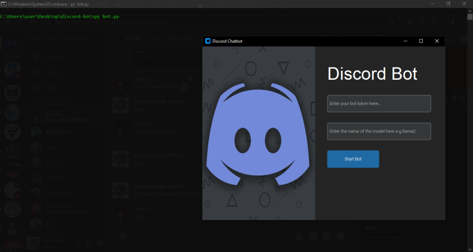
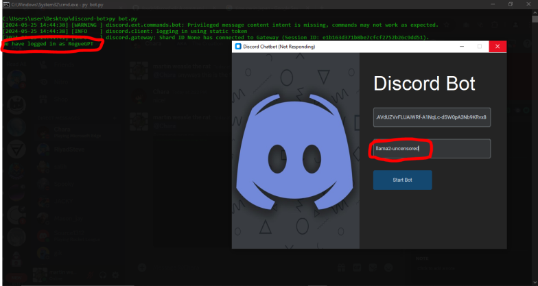
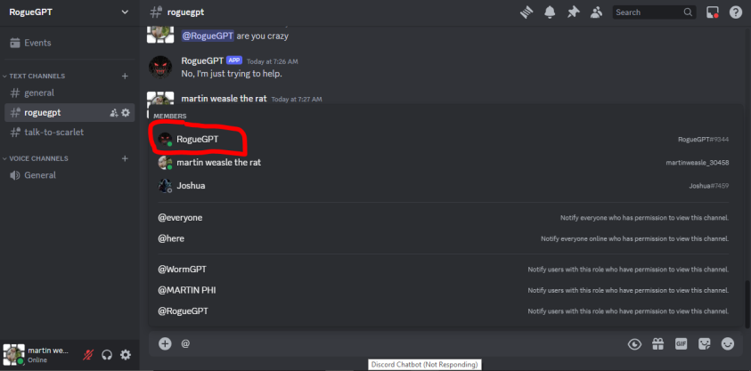

# Ollama-Discord-Chatbot  

##  Enchant your Discord server with engaging conversations!

**Martin-Weasel**  ‍  (Author)

This user-friendly Python project seamlessly integrates the power of `ollama`'s creative language models with your Discord server, providing an interactive and informative chatbot experience for your community.
https://github.com/Martin-Weasel/Ollama-Discord-Chatbot/blob/main/screenshot1.webp
## Screenshots




## Features  ⚙️

* **Effortless GUI:** Manage bot settings with a sleek and intuitive GUI built with `customtkinter`.
* **Customizable Control:**  Effortlessly configure your bot's token and preferred `ollama` model name.
* **`ollama` Powered:** Leverage the versatility of `ollama` to generate captivating responses to user messages.  🪄
* **Seamless Interaction:** Handles user mentions and direct messages flawlessly, keeping the conversation flowing.   ️➡️️

## Installation

**Prerequisites:**

* Python 3.x (https://www.python.org/downloads/)
* `discord.py` library (`pip install discord.py`)
* `ollama` library (`pip install ollama`)
* `customtkinter` library (`pip install customtkinter`)
* `Pillow` library (`pip install Pillow`)

**Steps:**

```
git clone https://github.com/Martin-Weasel/Ollama-Discord-Chatbot.git
cd Ollama-Discord-Chatbot
pip install -r requirements.txt
python3 bot.py
```
Replace the placeholder text in `bot_token_entry` and `model_name_entry` within the GUI with your actual Discord bot token and desired `ollama` model name (e.g., `llama2`).

## Usage

### 1. GUI

* Launch the GUI by running the script (as mentioned in Installation).
* Enter your Discord bot token and preferred `ollama` model name.
* Click the "Start Bot" button to initiate the chatbot.

### 2. Discord

* Once the bot is running, you can interact with it within your Discord server using your chosen command prefix (e.g., `@Chat `) followed by your message.

## Contributing

We welcome contributions from the community! Feel free to fork the repository, propose changes, and create pull requests. Here are some helpful tips:

- Follow consistent coding style and formatting.
- Include clear and concise comments in your code.
- Ensure your changes pass any existing tests (if applicable).

## License

This project is licensed under the (License Name) license. You can find the full license terms in the `LICENSE` file.  ["MIT"]("https://github.com/git/git-scm.com/blob/main/MIT-LICENSE.txt")

## Acknowledgments

A big thank you to the `ollama` developers for their innovative language modeling library. 

## Contact

Feel free to reach out with any questions or suggestions through martin.weasel895@email.com.

**Additional Tips:**

- Consider including screenshots of the GUI to showcase its design.
- You can add a badge or link to show that the project is built with Python (optional).
